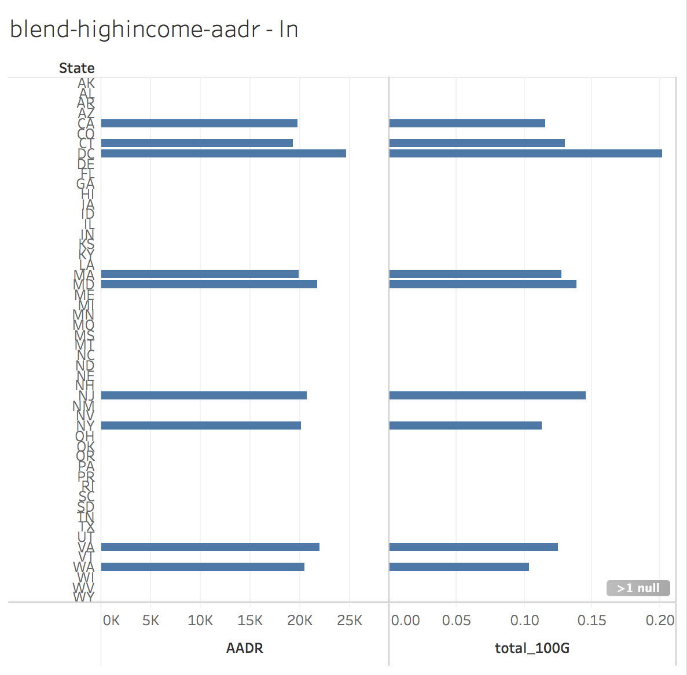
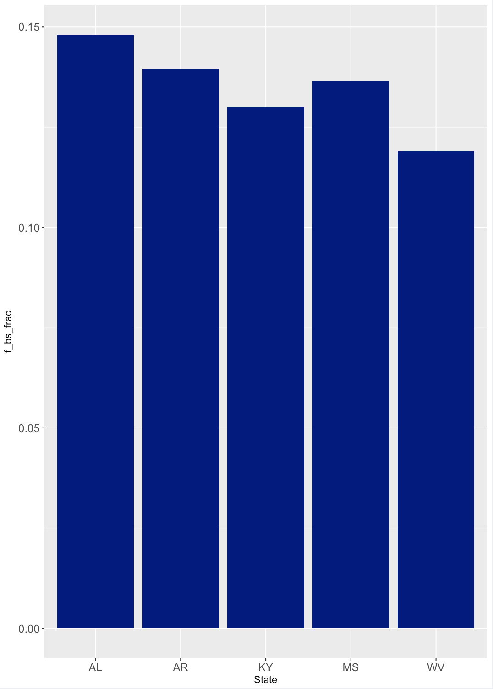
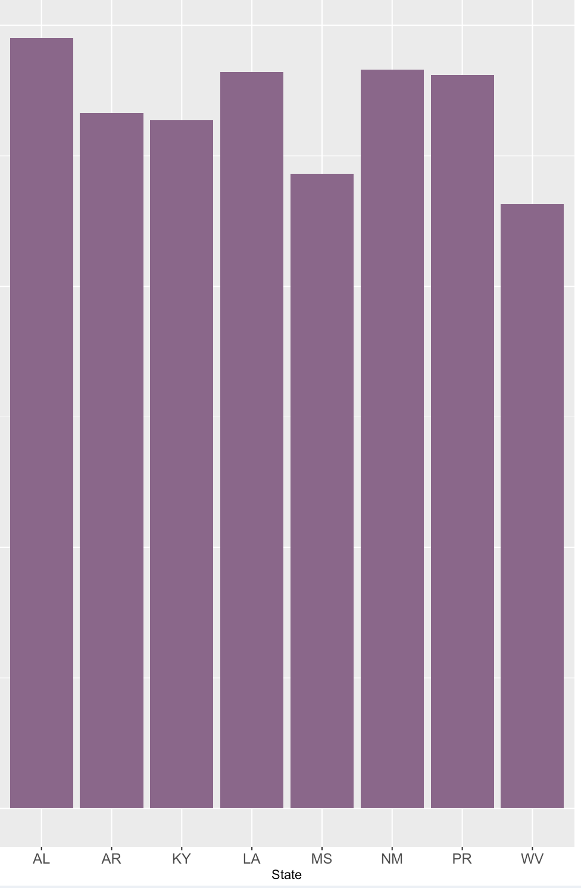

# **Introduction** 
### **R Session Info**

```{r echo=FALSE}
sessionInfo()
```

# **Description**
This notebook documents the education attainment levels and age-adjusted death rates (AADR) for different causes of death across the United States. The data has been organized to explore the relationship between education attainment and AAMR between 1999 and 2013. 

# **Data**
**How to download dataset from Data.World:**

1. Log into your account on https://data.world/
2. Under the *Datasets* tab, go to "S17 DV Final Project"
3. Scroll down until you reach "Death.csv"
4. Click on download
5. Save the file under a folder accessible by Tableau

**How to setup for ETL**

1. Set your working directory to 01 Data 
2. Download PreETL_Death.csv from data.world: https://data.world/ninaxhua/s-17-dv-final-project
3. Put PreETL_Death.csv into CSVs folder in the DataVisualizations folder

# **ETL Script**
The ETL script joins the Pre_ETL_Death dataframe with the education dataframe from US Census by AreaName (the state name)
``` {r echo=FALSE}
source("../01 Data/ETL_Script.R")
```

# **Visualizations**

## **Interesting Visualizations**

### **Decreasing death rate**


Death rate for each cause of death by year. **Average death rate (Red line) gradually decreases each year, visual evidence of increasing life span.** Death rate was normalized for population and age group variation.

### **Negative correlation between death rate and education level**


Death rate vs education level for every state. **There is a negative correlation between death rate and education level.** Education level was represented based on the proportion of the population that obtained a bachelor's degree.

### **Localization of high death rate and low education in the southeastern US**


Map of death rate and education level. **There is an apparent localization of high death rate coinciding with low education in the southeastern US states (RED)** 

## **Tableau**

### **Boxplot - Total death by cause**


This is a boxplot for each of the causes of death. The x-axis shows every cause of death, and the y-axis are the counts of the sepcific deatch cause for every state 
every year. The Data shows that HEart Disease and Cancer show the highest counts of death and also the greatest variabiliy. Box plots for other causes 
of death have less variability and less counts. 

### **Histogram - AADR for all causes in 2010**

This is a histogram of AADR by state. The x-axis are AADR bins starting at 580 and ending at 980 with increments of 20. The y-axis are the counts of states 
that fall into each bin. The histogram looks to be normal distribution with a small skew to the right. Additionally, there is a mini cluster in the 880-960
AADR range. Most states fall into the 700-800 AADR range. 

### **Scatterplot - AADR vs Fraction BS by State**

Scatterplot displays aggregate AADR vs fraction of BS attainment for each state. Note the negative correlation between AADR and BS attainment.

### **Barchart - AADR by Year**

Barchart displays the sum of the AADR per cause from 1999-2013. 
The average sum of AADR for all causes do not vary greatly per year.
Heart Disease, Cancer, and Stroke have consistently higher sums of AADR than the average AADR for all causes.  

### **Bachelor's Degree Attainment: Female**

**High Level**

Barchart displays females who've attained a Bachelor's Degree. 
The page only shows the set of states that hosted high levels of female BS attainment (0.15-0.25).
Compared to males, females also had a greater amount of states with high levels. 

**Low Level**
 
Barchart displays females who've attained a Bachelor's Degree. 
The page only shows the set of states that hosted low levels of female BS attainment (<0.15).

### **Bachelor's Degree Attainment: Male**

**High Level**
 
Barchart displays males who've attained a Bachelor's Degree. 
The page only shows the set of states that hosted high levels of male BS attainment (0.15-0.25).

**Low Level**
 
Barchart displays males who've attained a Bachelor's Degree. 
The page only shows the set of states that hosted low levels of male BS attainment (<0.15).

### **Map - AADR and BS Attainment Level Localization**


US map of states filled by Bachelor's degree attainment (top) and AADR (bottom). Note that localization of low degree attainment and high AADR coincide.

### **Blending - AADR and High Income**


This visualization displays the use of Tableau Data Blending and Set IDs. “total_100G" is a measure created using the formula “(m_100G_more + f_100G_more) / total”, which outputs the proportion of individuals who made $100,000 or more within a particular state. Afterwards, the set “max_high_income” contains the states that had a proportion of 0.10 or higher. Those in “max_high_income” had similar AADR values (range: 19,316 in Connecticut and 21,938 in Virginia) with the exception of D.C. which hosted a relatively high AADR (24,620). On the other hand, the states that were not in the set had a wider range of AADR values. It was interesting to observe that Mississippi had the highest AADR (27,595) and Hawaii had the lowest AADR (17,222) while remaining in the set of states that did not have a large proportion of individuals with higher incomes. Our data suggests that states with a higher proportion of individuals who make $100,000 or more host similar AADR while states with a lower proportion host a range of AADR. The range could be explained by causes not included in our dataset, but is worth further exploring with different census datasets.

## **Shiny**
#### **Published Shiny app link**
https://steventran.shinyapps.io/finalproject/

### **Boxplot - Total death by cause**

This is a boxplot for each of the causes of death. The x-axis shows every cause of death, and the y-axis are the counts of the sepcific deatch cause for every state 
every year. The Data shows that HEart Disease and Cancer show the highest counts of death and also the greatest variabiliy. Box plots for other causes 
of death have less variability and less counts. 

### **Histogram - AADR for all causes in 2010**

This is a histogram of AADR by state. The x-axis are AADR bins starting at 580 and ending at 980 with increments of 20. The y-axis are the counts of states 
that fall into each bin. The histogram looks to be normal distribution with a small skew to the right. Additionally, there is a mini cluster in the 880-960
AADR range. Most states fall into the 700-800 AADR range. 

### **Scatterplot - Normalized Death Rate vs Education Level by State**

Scatterplot displays aggregate AADR vs fraction of BS attainment for each state. Note the negative correlation between AADR and BS attainment.

### **Barchart - AADR by Year**

Full Barchart - Note the gradually decreasing average AADR line (red). This shows the steady lowering of death rate over time.


Zoomed excerpt of the barchart. Note that heart disease and cancer are the leading causes of death across these states.

### **Bachelor's Degree Attainment: Female**

**High Level**

Barchart displays females who've attained a Bachelor's Degree. 
The page only shows the set of states that hosted high levels of female BS attainment (0.15-0.25).
Compared to males, females also had a greater amount of states with high levels. 

**Low Level**
 
Barchart displays females who've attained a Bachelor's Degree. 
The page only shows the set of states that hosted low levels of female BS attainment (<0.15).

### **Bachelor's Degree Attainment: Male**

**High Level**
 
Barchart displays males who've attained a Bachelor's Degree. 
The page only shows the set of states that hosted high levels of male BS attainment (0.15-0.25).

**Low Level**

Barchart displays males who've attained a Bachelor's Degree. 
The page only shows the set of states that hosted low levels of male BS attainment (<0.15).

### **Map - AADR and BS Attainment Level Localization**

US map of states filled by Bachelor's degree attainment (top) and AADR (bottom). Note that localization of low degree attainment and high AADR coincide.

