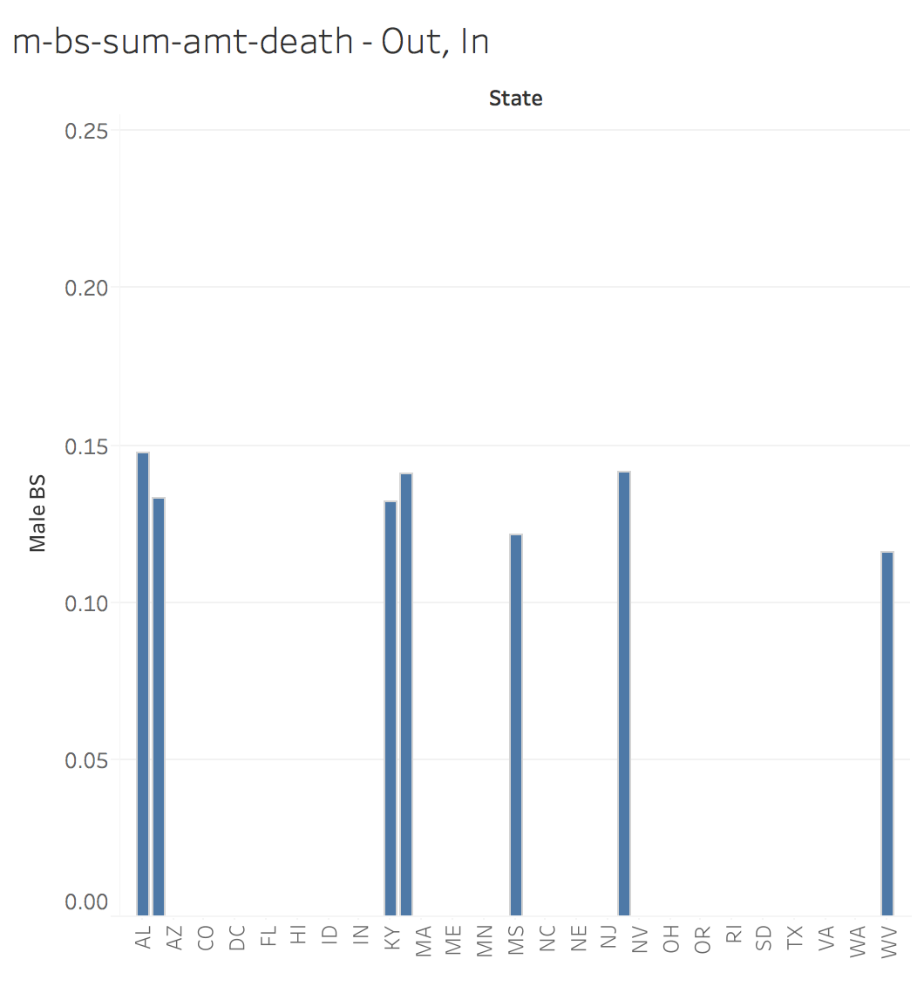

# **Introduction** 
### **R Session Info**

```{r echo=FALSE}
sessionInfo()
```

# **Description**
This notebook documents the education attainment levels and age-adjusted death rates (AADR) for different causes of death across the United States. The data has been organized to explore the relationship between education attainment and AAMR between 1999 and 2013. 

# **Data**
**How to download dataset from Data.World:**

1. Log into your account on https://data.world/
2. Under the *Datasets* tab, go to "S17 eDV Project 6"
3. Scroll down until you reach "Death.csv"
4. Click on download
5. Save the file under a folder accessible by Tableau

# **ETL Script**
``` {r echo=FALSE}
source("../01 Data/ETL_Script.R")
```

# **Visualizations**

## **Tableau**

### **Scatterplot - AADR vs Fraction BS by State**
</div></center>
Scatterplot displays aggregate AADR vs fraction of BS attainment for each state. Note the negative correlation between AADR and BS attainment.

### **Barchart - AADR by Year**
</center>
Barchart displays the sum of the AADR per cause from 1999-2013. 
The average sum of AADR for all causes do not vary greatly per year.
Heart Disease, Cancer, and Stroke have consistently higher sums of AADR than the average AADR for all causes.  

### **Bachelor's Degree Attainment: Female**

**High Level**
</center>
Barchart displays females who've attained a Bachelor's Degree. 
The page only shows the set of states that hosted high levels of female BS attainment (0.15-0.25).
Compared to males, females also had a greater amount of states with high levels. 

**Low Level**
</center> 
Barchart displays females who've attained a Bachelor's Degree. 
The page only shows the set of states that hosted low levels of female BS attainment (<0.15).

### **Bachelor's Degree Attainment: Male**

**High Level**
</center> 
Barchart displays males who've attained a Bachelor's Degree. 
The page only shows the set of states that hosted high levels of male BS attainment (0.15-0.25).

**Low Level**
</center> 
Barchart displays males who've attained a Bachelor's Degree. 
The page only shows the set of states that hosted low levels of male BS attainment (<0.15).


## **Shiny**
#### **Published Shiny app link**
https://steventran.shinyapps.io/project6_shiny/

### **Scatterplot - AADR vs Fraction BS by State**
</center>
Scatterplot displays aggregate AADR vs fraction of BS attainment for each state. Note the negative correlation between AADR and BS attainment.

### **Barchart - AADR by Year**
</center>
Full Barchart - Note the gradually decreasing average AADR line (red). This shows the steady lowering of death rate over time.

</center>
Zoomed excerpt of the barchart. Note that heart disease and cancer are the leading causes of death across these states.

### **Bachelor's Degree Attainment: Female**

**High Level**
</center>
Barchart displays females who've attained a Bachelor's Degree. 
The page only shows the set of states that hosted high levels of female BS attainment (0.15-0.25).
Compared to males, females also had a greater amount of states with high levels. 

**Low Level**
</center> 
Barchart displays females who've attained a Bachelor's Degree. 
The page only shows the set of states that hosted low levels of female BS attainment (<0.15).

### **Bachelor's Degree Attainment: Male**

**High Level**
</center> 
Barchart displays males who've attained a Bachelor's Degree. 
The page only shows the set of states that hosted high levels of male BS attainment (0.15-0.25).

**Low Level**
</center> 
Barchart displays males who've attained a Bachelor's Degree. 
The page only shows the set of states that hosted low levels of male BS attainment (<0.15).

## **Map - AADR and BS Attainment Level Localization**
</center>
US map of states filled by Bachelor's degree attainment (top) and AADR (bottom). Note that localization of low degree attainment and high AADR coincide.

